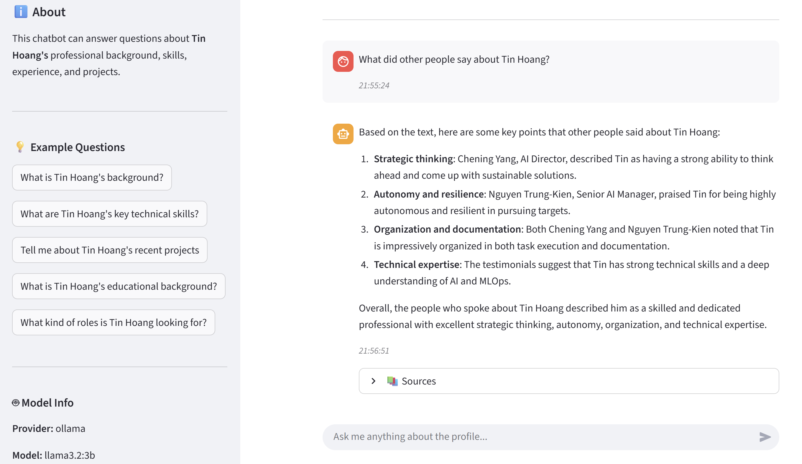

# 🤖 SLM Profile RAG Chatbot

<p align="center">
  
</p>

<p align="center">
  
  
  
  
  
  
  
</p>

A RAG (Retrieval Augmented Generation) chatbot that answers questions about your professional profile using your resume, project reports, and other documents.

## ✨ Features

- 📄 **Multi-format Support**: Process PDF, Word, HTML, and text documents
- 🔍 **Hybrid Search**: Combines BM25 (keyword) + Vector (semantic) search with Reciprocal Rank Fusion
- 🧠 **Extensible Retrieval**: Pluggable strategy system - easily add new retrieval methods (PageIndex, GraphRAG, etc.)
- 📌 **Main Document Support**: Guaranteed context - critical information always available, auto-format detection
- 🦙 **Ollama Integration**: Run small language models locally
- 🎨 **Clean UI**: Streamlit-based interface
- ⚙️ **Highly Configurable**: YAML-based settings for easy customization
- 🚀 **HuggingFace Spaces Ready**: Deploy with one click
- ✨ **Smart Response Enhancement**: Automatically removes negative language and adds professional, recruiter-friendly tone

## 🏗️ Architecture

<p align="center">
  
</p>
<p align="center"><em>Overall system design showing the RAG pipeline and component interactions</em></p>

Detailed architecture can be found in [ARCHITECTURE.md](ARCHITECTURE.md).

## 🛠️ Tech Stack

- **Python 3.10+** with UV package manager
- **LangChain** for RAG pipeline
- **ChromaDB** for vector storage
- **rank-bm25** for lexical search
- **Ollama** for local LLM serving
- **Streamlit** for web interface
- **sentence-transformers** for embeddings
- **tiktoken** for token counting
- **Ruff** for linting/formatting

## 📦 Installation

### Prerequisites

1. **Python 3.10+**
2. **UV Package Manager**: Install via:
   ```bash
   curl -LsSf https://astral.sh/uv/install.sh | sh
   ```
3. **Ollama**: Install from [ollama.ai](https://ollama.ai)

### Setup

1. **Clone the repository**:
   ```bash
   git clone <your-repo-url>
   cd slm-profile-rag
   ```

2. **Install dependencies with UV**:
   ```bash
   uv venv
   source .venv/bin/activate  # On Windows: .venv\Scripts\activate
   uv pip install -r requirements.txt
   ```

3. **Set up environment variables**:
   ```bash
   cp .env.template .env
   # Edit .env with your settings
   ```

4. **Configure the chatbot**:
   - Edit `config.yaml` to set your name, title, and preferences
   - Adjust model settings, chunking parameters, and system prompt

5. **Add your documents**:
   ```bash
   # Place your PDFs, Word docs, HTML files in:
   mkdir -p data/documents
   # Copy your resume, project reports, LinkedIn profile, etc.
   ```

6. **Create your Main Profile Document** (📌 **Recommended**):

   The Main Document feature ensures critical information is **always** included in responses, never missed by vector search.

   ```bash
   # Create main profile document (any format: .md, .txt, .pdf, .docx, .html)
   nano data/documents/main_profile.md
   ```

   **Include essential information:**
   - Full name, title, contact info
   - Current role and key responsibilities
   - Core skills and expertise
   - Major projects with metrics
   - Education and certifications

   **Example structure:**
   ```markdown
   # Your Name
   **Title**: Your Professional Title
   **Email**: your.email@example.com

   ## Professional Summary
   Brief summary of your experience...

   ## Core Skills
   - Skill 1, Skill 2, Skill 3

   ## Current Role
   ### Company - Role (Dates)
   - Achievement 1 with metrics
   - Achievement 2 with metrics

   ## Education
   - Degree, University, Year
   ```

   **Why use this?**
   - ✅ **Guaranteed Context**: Critical info never missed by vector similarity search
   - ✅ **Priority Positioning**: Appears BEFORE retrieved chunks (higher LLM attention)
   - ✅ **Auto-Format Detection**: Supports MD, TXT, PDF, DOCX, HTML automatically
   - ✅ **Smart Token Management**: LLM-based summarization if content exceeds 10k tokens

   The feature is enabled by default in `config.yaml`. See [docs/MAIN_DOCUMENT_GUIDE.md](docs/MAIN_DOCUMENT_GUIDE.md) for advanced configuration.

7. **Pull Ollama model**:
   ```bash
   ollama pull llama3.2:3b
   # Or other small models: phi3:mini, gemma2:2b
   ```

## 🚀 Usage

### Local Development

1. **Build the retrieval index** (default: hybrid BM25 + Vector):
   ```bash
   # Build with default strategy from config (bm25_vector)
   python -m src.build_vectorstore

   # Or specify a strategy explicitly
   python -m src.build_vectorstore --strategy bm25_vector  # Hybrid (recommended)
   python -m src.build_vectorstore --strategy vector       # Vector-only
   python -m src.build_vectorstore --strategy bm25         # BM25-only
   ```

2. **Run the Streamlit app**:
   ```bash
   streamlit run app.py
   ```

3. **Open browser**: Navigate to `http://localhost:8501`

**Screenshot Example:**

<p align="center">
  
</p>
<p align="center"><em>Streamlit chatbot interface in action</em></p>

## 🌐 Deployment to Hugging Face Spaces

### Option 1: Direct Upload

1. Create a new Space on [Hugging Face](https://huggingface.co/spaces)
2. Select "Streamlit" as SDK
3. Upload all files from this repository
4. Add your documents to `data/documents/`
5. The Space will automatically build and deploy

### Option 2: Git Integration

1. Create a new Space and connect to Git
2. Push this repository:
   ```bash
   git remote add hf https://huggingface.co/spaces/YOUR_USERNAME/SPACE_NAME
   git push hf main
   ```

### Important Notes for HF Spaces

- **Ollama in HF Spaces**: You'll need a persistent Ollama server or use the Space's GPU
- **Vector DB**: Pre-build your ChromaDB locally and include it (or rebuild on startup)
- **Memory**: Small models (3B-7B params) work best on free tier
- **Secrets**: Add API keys in Space settings if using alternative LLM providers

## ⚙️ Configuration

### `config.yaml` - Main Settings

```yaml
profile:
  name: "Your Name"  # ← Change this!
  title: "Your Title"

llm:
  model: "llama3.2:3b"  # Choose your model
  temperature: 0.7

# Retrieval Strategy Configuration
retrieval:
  strategy: "bm25_vector"  # Options: vector, bm25, bm25_vector
  final_k: 4               # Number of documents to return

  vector:
    search_type: "similarity"
    k: 10                  # Docs to retrieve before fusion

  bm25:
    k: 10                  # Docs to retrieve before fusion
    tokenizer: "simple"

  fusion:
    algorithm: "rrf"       # Reciprocal Rank Fusion
    weights:
      vector: 0.7          # 70% weight on semantic search
      bm25: 0.3            # 30% weight on keyword search

document_processing:
  chunk_size: 1000
  chunk_overlap: 200
```

### `.env` - Environment Variables

```bash
OLLAMA_BASE_URL=http://localhost:11434
CHROMA_PERSIST_DIR=./chroma_db
```

## 📚 Project Structure

```
slm-profile-rag/
├── app.py                          # Streamlit app entry point
├── pyproject.toml                  # UV/pip dependencies & config
├── config.yaml                     # RAG & LLM settings
├── .env.example                    # Environment variables template
├── README.md
├── data/
│   └── documents/                  # Your profile documents
├── src/
│   ├── __init__.py
│   ├── document_processor.py       # Load & chunk documents
│   ├── vectorstore.py              # ChromaDB operations
│   ├── llm_handler.py              # Ollama/LLM interface
│   ├── rag_pipeline.py             # RAG chain logic
│   ├── main_document_loader.py     # Main document management
│   ├── response_enhancer.py        # Response post-processing
│   ├── config_loader.py            # Load config.yaml & .env
│   ├── build_vectorstore.py        # CLI to build indexes
│   └── retrieval/                  # Extensible retrieval system
│       ├── __init__.py
│       ├── base.py                 # BaseRetrieverStrategy ABC
│       ├── factory.py              # RetrieverFactory
│       ├── fusion.py               # RRF and fusion algorithms
│       ├── stores/
│       │   └── bm25_store.py       # BM25 index storage
│       └── strategies/
│           ├── vector.py           # Vector-only strategy
│           ├── bm25.py             # BM25-only strategy
│           └── bm25_vector.py      # Hybrid BM25+Vector strategy
├── chroma_db/                      # Vector database (auto-generated)
├── bm25_index/                     # BM25 index (auto-generated)
└── tests/                          # Unit tests
```

## 🎯 Recommended Models for HF Spaces

| Model | Size | Speed | Quality | HF Spaces Tier |
|-------|------|-------|---------|----------------|
| `llama3.2:3b` | 3B | Fast | Good | Free ✅ |
| `phi3:mini` | 3.8B | Fast | Good | Free ✅ |
| `gemma2:2b` | 2B | Very Fast | Decent | Free ✅ |
| `llama3.1:8b` | 8B | Medium | Great | Upgraded GPU |

## 🔍 LLM Tracing with LangSmith

Monitor prompts, responses, and latency using [LangSmith](https://smith.langchain.com).

### Setup

1. **Get API Key**: Sign up at [smith.langchain.com](https://smith.langchain.com) (free tier: 5,000 traces/month)

2. **Configure `.env`**:
   ```bash
   LANGCHAIN_TRACING_V2=true
   LANGCHAIN_API_KEY=your_api_key_here
   LANGCHAIN_PROJECT=slm-profile-rag
   ```

3. **Restart the app**:
   ```bash
   streamlit run app.py
   ```

### What You Can See

- Full prompts sent to LLM (system prompt + context + question)
- Complete LLM responses
- Latency breakdown per step
- Token usage (when available)

## 🔧 Troubleshooting

### Ollama Connection Issues
```bash
# Check Ollama is running
ollama list

# Start Ollama service
ollama serve
```

### ChromaDB / Index Errors
```bash
# Rebuild all indexes from scratch
rm -rf chroma_db/ bm25_index/
python -m src.build_vectorstore --force-rebuild
```

### HuggingFace Spaces Issues
- Check logs in the Space's "Logs" tab
- Ensure `requirements.txt` is generated: `uv pip compile pyproject.toml -o requirements.txt`
- Verify GPU/CPU settings match your model size

## 📄 License

MIT License - see LICENSE file

---

**Note**: Remember to update `config.yaml` with your personal information before deploying!
